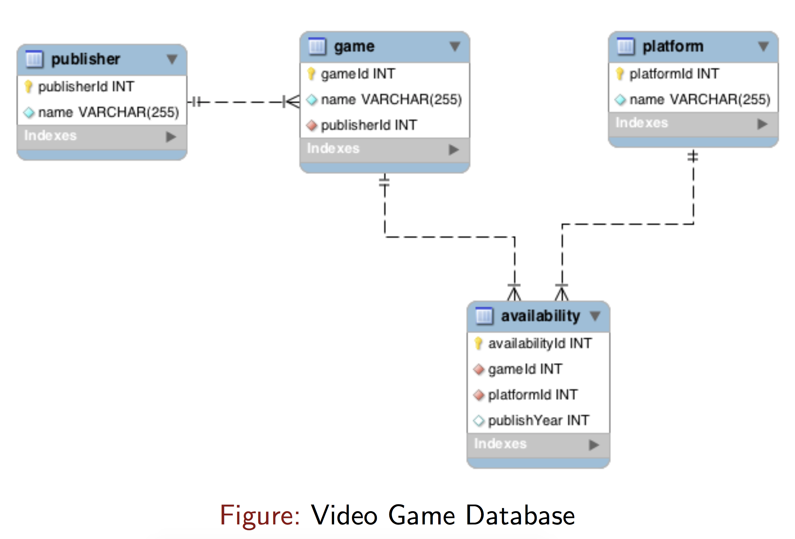

# Databases & SQL
## CSCE 156 - Spring 2020

### Introduction/Overview


* Flat data files are insufficient for storing data
  * Repetition of data
  * Formatting issues
  * Consistency issues
  * Integrity issues
  * Organization problems: not sorted, it is in one big file (no multithreaded or multiuser capability)
  * There is no security!

  
* Solution: use a RDBMS (Relational Database Management System)
  * 1970 Edgar Codd (1970, IBM)
  * Key aspects: data is stored in *tables*
  * Data is stored in columns (fields)
  * Records are stored as rows
  * Each row may have a unique identifier (Primary Key, PK)
  * Rows (records) in different tables may be related through Foreign Keys (FK)
  
* You can interact with a RDBMS through CRUD:
  * Create (`insert`)
  * Retrieve (`select`)
  * Update (`update`)
  * Destroy (`delete`)
  
## Demonstration




```sql

-- C= create,
-- create some game records...
-- to do so, we need to first create some publisher records

select * from publisher;
select * from game;

insert into publisher (name) values ("Activision");
insert into publisher (name) values ("Mojang");

-- You can, hard code key values:
insert into game (gameId, name, publisherId) values (102, "Minecraft", 16);
insert into game (name, publisherId) values ("Destiny 2", 14);

-- you may instead want to use *nested queries*
insert into game (name, publisherId) values ("Destiny 2",
  (select publisherId from publisher where name = "Activision"));

-- oops: we have two publishers named "Activision" remove one of them
delete from publisher where publisherId = 15;
delete from publisher where publisherId = 17;

-- U = Update
-- you can update a current record using the update keyword
update game set name = "Destiny II" where gameId = 103;
update game set name = "Destiny II" where gameId = 
  (select gameId from game where name = "Destiny 2");
  
-- style:
-- comments start with a --(space)
-- keywords are case insensitive
-- old school style: use ALL UPPER CASE
-- modern style: use all lower case
-- you can align/go to the next line as necessary to avoid long lines like this one; don't do long lines like this
UPDATE game SET NAME = "Destiny II";

-- D = destroy, to remove/delete records use the delete keyword
delete from game;
delete from game where gameId = 103;

-- R = retrieve
-- To retrieve records in a database, you use the select keyword

-- retrieve all game records:
select * from game;
-- retrieve all publisher records:
select * from publisher;

-- the star operator selects every column from the table
-- if you only want a subset of columns you can be explicit:
select name, publisherId from game;
-- sometimes its also helpful to rearrange and rename or "alias" your columns:
select name as gameTitle, 
		   publisherId as pubId 
           from game;

-- you can use basic logic operators using a where clause:
select * from game where gameId > 5 and gameId <= 10 or gameId = 1;

-- you can also use string comparisons:
-- default seems to be case sensitive
select * from game where name = "minecraft";
select * from game where name = "Minecraft";

-- you can also do fuzzy string comparisons:
select * from game where name like 'G%';
select * from game where name like '%r%r%';
-- result in any game that ends with a lower case g:
select * from game where name like '%g';
select * from game where name like '\%r%';


-- You can combine one or more tables using the join keyword:=
select * from game join publisher on game.publisherId = publisher.publisherId;

-- you can shorten up a long query by aliasing the table names as well:
select g.name as gameTitle, 
           p.name as publisherName
           from game g join publisher p on g.publisherId = p.publisherId;

-- get all the data with multiple joins:

select * from game g 
  join publisher p on g.publisherId = p.publisherId
  join availability a on a.gameId = g.gameId
  join platform pub on pub.platformId = a.platformId;

-- left joins preserve records for which there is no match
select * from game g 
  left join publisher p on g.publisherId = p.publisherId
  left join availability a on a.gameId = g.gameId
  left join platform pub on pub.platformId = a.platformId;
```

